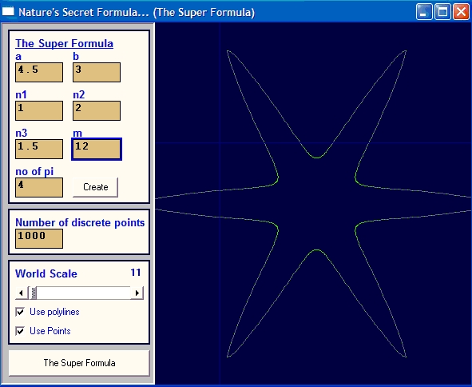



## nature's secret formulation

### Description

"Pi" number has always been my interest.

In year 2002 a scientist Johan Gielis found a formulation that simulates geometrical shapes of organic materials. This code, put those life forms on screen. Enjoy.
 
### More Info
 
Manuplate the parameters and be amazed.

My code does little, applause should go to the scientist...

Viwers can alter the code and may turn it into a nice screen saver. I will be dealing with the Directx version.(Lots of colors)

no side effects.

             |
---                |---
**Submitted On**   |2004-05-19 09:35:04
**By**             |[devrim pakkan](https://github.com/Planet-Source-Code/PSCIndex/blob/master/ByAuthor/devrim-pakkan.md)
**Level**          |Advanced
**User Rating**    |4.4 (31 globes from 7 users)
**Compatibility**  |VB 5\.0, VB 6\.0
**Category**       |[Graphics](https://github.com/Planet-Source-Code/PSCIndex/blob/master/ByCategory/graphics__1-46.md)
**World**          |[Visual Basic](https://github.com/Planet-Source-Code/PSCIndex/blob/master/ByWorld/visual-basic.md)
**Archive File**   |[nature's\_s1747425192004\.zip](https://github.com/Planet-Source-Code/devrim-pakkan-nature-s-secret-formulation__1-53882/archive/master.zip)

